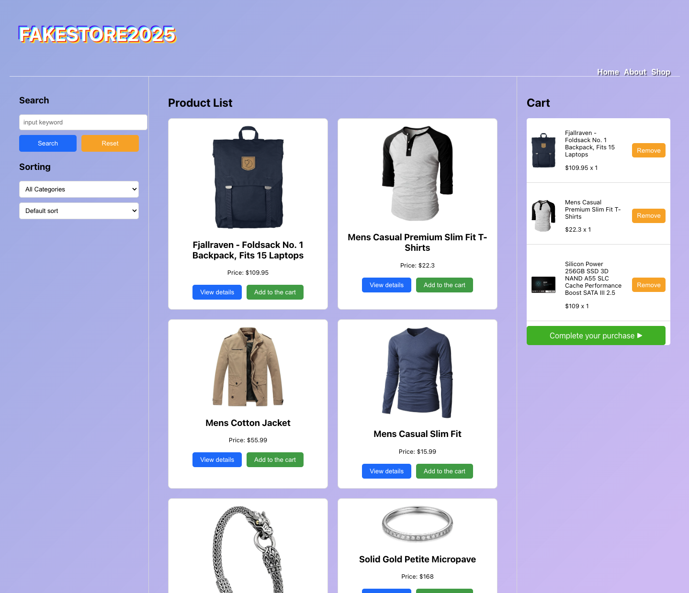
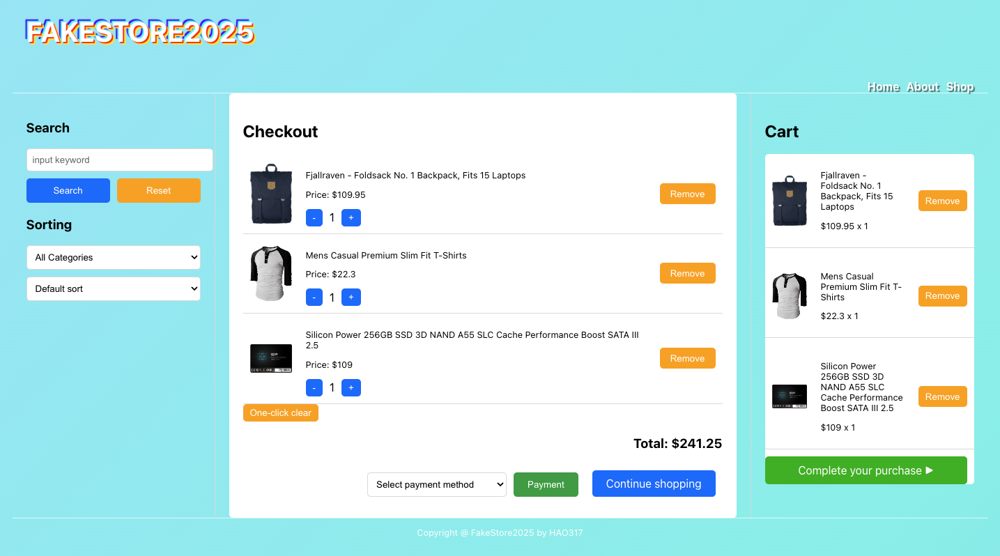

# React FakeStore 2025

Project Overview

React FakeStore 2025 is a modern e-commerce web application built with React, designed to simulate an online shopping experience. The application integrates with the Fake Store API to display products, manage a shopping cart, and provide a responsive user interface for seamless browsing across devices.

Features

Product Listings: Browse a catalog of products fetched dynamically from the Fake Store API.

Shopping Cart: Add, remove, and update items in the cart with real-time calculations.

Responsive Design: Optimized for desktops, tablets, and mobile devices using Tailwind CSS.

Category Filtering: Filter products by categories for efficient navigation.

Product Details: View detailed information about individual products.

Technologies Used

Frontend: React, JavaScript (ES6+), HTML5, CSS3

Styling: Tailwind CSS

API Integration: Axios for fetching data from the Fake Store API

Build Tool: Vite for fast development and production builds

Deployment: GitHub Pages for hosting the demo

Demo site:
https://hao-317.github.io/React-FakeStore2025/
